## Introduction 
All of the DMA Power BI datasets reside in this repository along with a helper cli tool to aid with parsing of the models and swapping multi partitions in and out for report development.
This repository is synced to the [D&A Dev - Dr. Martens Datasets](#https://app.powerbi.com/groups/e8649e55-b7f9-42aa-91f7-326ed4c8a36d/list?experience=power-bi) which is then deployed to higher level environments, 

## Contents

- [Repository Structure:](#repository-structure)
    - [partitions directory:](#partitions-directory)
    - [reports directory:](#reports-directory)
    - [utils directory:](#utils-directory)
    - [docs directory:](#docs-directory)
  - [Power BI Workspaces:](#power-bi-workspaces)
  - [Deployment:](#deployment)
  - [Deployment Notes](#deployment-notes)
    - [Pipeline Deployment Timing](#pipeline-deployment-timing)
    - [Report Unique Identifier](#report-unique-identifier)
    - [Current deficiencies:](#current-deficiencies)
  - [Power BI Reports:](#power-bi-reports)
    - [Power BI Report Format](#power-bi-report-format)
    - [Time Intelligence](#time-intelligence)
    - [Report Level Access](#report-level-access)
    - [Row Level Security](#row-level-security)
    - [Partitions](#partitions)
      - [Partition Refresh](#partition-refresh)
        - [Using SSMS](#using-ssms)
- [Utilities Installation](#utilities-installation)
      - [Installing with pip](#installing-with-pip)
      - [Installation with Poetry:](#installation-with-poetry)
    - [Service Account:](#service-account)
      - [Azure Application Principle:](#azure-application-principle)
    - [Premium Workspace:](#premium-workspace)
    - [Report Settings:](#report-settings)
    - [Notes and Issues:](#notes-and-issues)
- [Contribute:](#contribute)

# Repository Structure:
```
.
├── docs
│   └── images
└── powerbi
    ├── partitions
    ├── reports
    └── utils
```
### partitions directory:
This directory is used to store multi-partition models when the cli tool is used swap multi-partitions in and out. This directory is required to be set up for multi-partitions models, you will need to put a single partition in here that will be used to swap with the multi-partition query.
```
.
├── DMA D2C
│   ├── Availability
│   └── Orders
├── DMA GL
│   └── General Ledger Fact
├── DMA Operations
│   ├── Availability
│   ├── Intake
│   └── Movements
└── DMA Total Business
    └── Orders
```

In the above directory structure, you can see that the top level structure matches the name of the report and the second level needs to match the name of the query, within this directory you need to add a file called `original.yaml` with the partition that you want to replace in the multiple partition query.

### reports directory:
All Power BI reports and model are stored in this directory and are synced to the Power BI dev Workspace, [D&A Dev - Dr. Martens Datasets](#https://app.powerbi.com/groups/e8649e55-b7f9-42aa-91f7-326ed4c8a36d/list?experience=power-bi)

### utils directory:
Contains helper python code including cli tool to remove and add partitions.

### docs directory:
At the minute this is just used for `images` in the README.md, but can be used for any addition documentation.

## Power BI Workspaces:

We currently have three Power BI Workspaces.

|  Environment  |  Workspace |
|---|---|
|   |   |


## Deployment:
Deployment of the datasets is via a combination of an Azure repository, [windermere_powerbi](#https://projectreboot.visualstudio.com/Windermere%20Discovery/_git/windermere_powerbi/pullrequests?_a=mine), then manually syncing the `main` branch to the [D&A Dev - Dr. Martens Datasets](#https://app.powerbi.com/groups/e8649e55-b7f9-42aa-91f7-326ed4c8a36d/list?experience=power-bi) workspace in Power BI. Once the models have been deployed to development workspace they can be deployed to higher environments using the deployment pipeline, [Dr Marten's Datasets DP](#https://app.powerbi.com/pipelines/37cfd15a-6d60-4fd6-ba6d-86fd1a042d8d?experience=power-bi).

Once changes have been merged to the `main` branch of the repository, [windermere_powerbi](#https://projectreboot.visualstudio.com/Windermere%20Discovery/_git/windermere_powerbi/pullrequests?_a=mine), you should be able to see the changes on the `Source control` button in the UI as you can see below. Clicking on the button will opened up a new panel on the right hand side with all changes that you can see in the in the second image below. The `Source control` panel should show you any changes that require to sync in both directions but I would advise not making any changes outside of the repository directly, it should be a one way process, from repository to power bi.

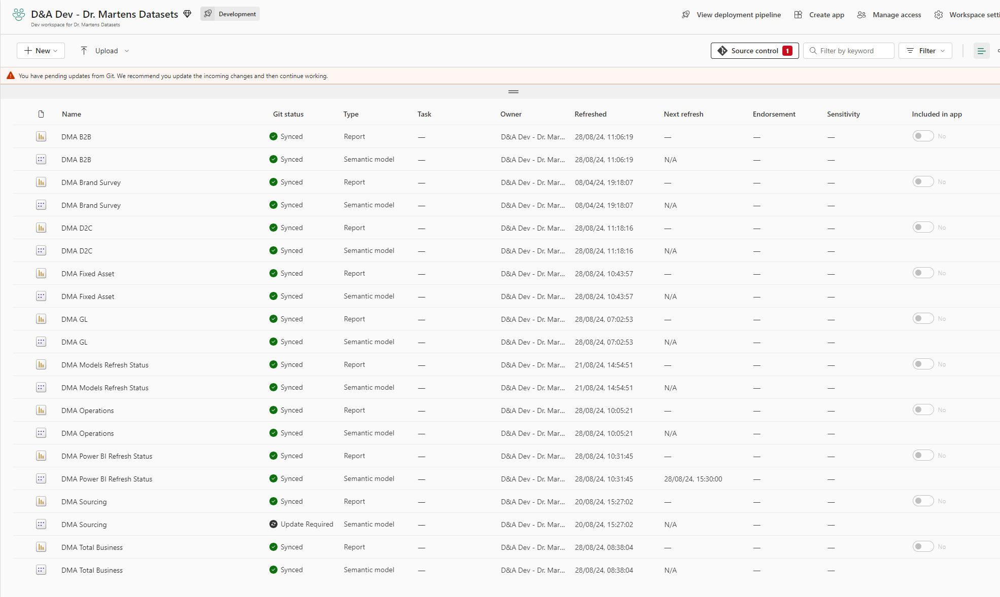

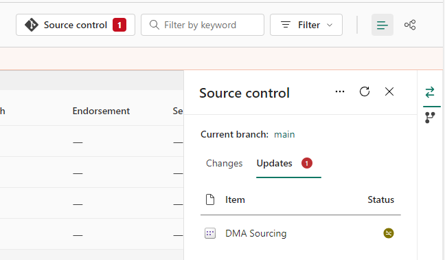

There can sometimes be sync issues between the repository and Power BI, in such cases you will be presented with the option to overwrite the changes, if you are confident the repository is correct then you can go ahead and overwrite the changes. You will also be given the option to sync the changes, again I would advise against this. If you want to see the changes that might have caused the issues you can sync the workspace to a new branch and then perform a diff between main and the new branch to see why a conflict exists. I don't recall if you are given the option to create this branch in this situation but you can do this manually. The change can be made in the `Workspace Settings`, as you can see below you can change the branch below.

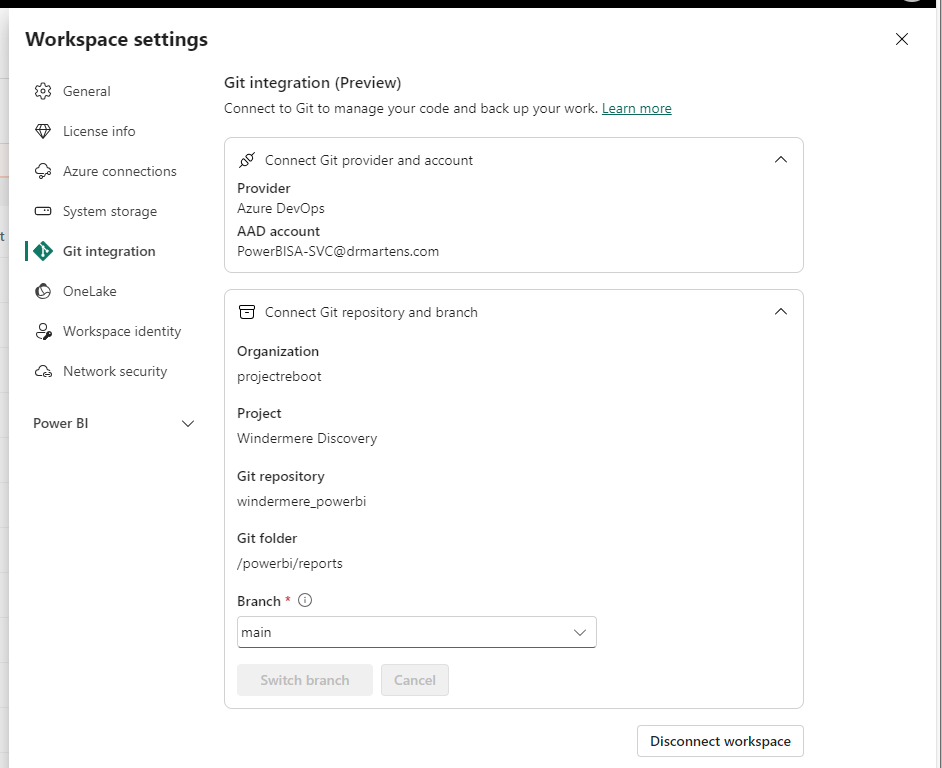


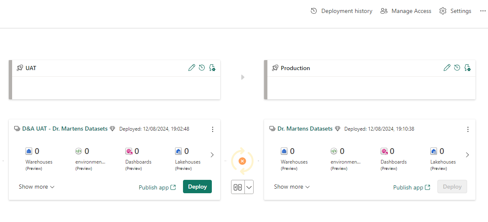

To deploy all models from Development to UAT simply click the `Deploy` button in the Development pipeline and similarly to deploy from UAT to production click the `Deploy` button in the UAT section.

You can perform a selective deployment by cherry picking what you want to deploy from one environment to the next. You can do this by clicking on the dropdown arrow below between the environments, as you can see below, and clicking on `Compare`. 

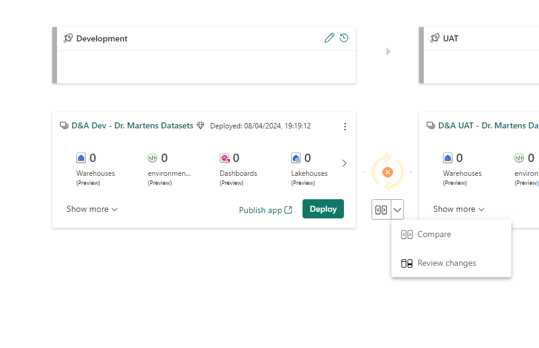

Clicking on `Compare` allows you to see the differences between the two environments at a glance and also allows you to be selective about which reports you want to deploy to the next stage, as you can see in the below image I have only selected `DMA Operations` for deployment. Note that you cannot see these selection boxes until you hover over the artifact. In fact there are also chance to review the changes in a difference comparison window that will also appear so that you can check the changes to be deployed. This is also possible to access directly from the main dropdown which can be seen in the above image.

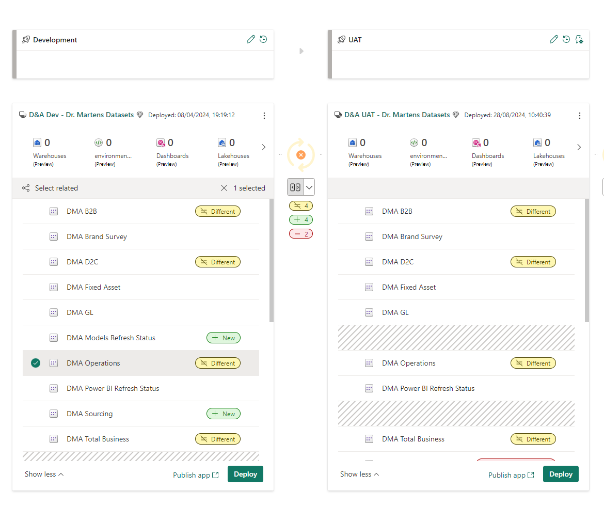
## Deployment Notes

### Pipeline Deployment Timing
You cannot deploy a change while a report is being refreshed or queried so try to avoid the refresh 3 refresh windows. You can see the **rough** time window below.

|Region   | Time Zone | Start Time  | End Time |
|---|---|---|---|
| APAC  | Asia/Hong_Kong | 05:00  |  09:00  |
| EMEA  | Europe/London | 05:00  |  09:00  |
| US  | US/Pacific" | 05:00  |  09:00  |

If you do try to deploy at these times the deployment will most likely fail gracefully but you will just get the loading spinner graphic until the deployment times out which can be quite some time.

### Report Unique Identifier
Each model, report, object is given a unique id, it is important to maintain these IDs as some user will directly refer to the report using its' unique ID. An objects ID will be maintained if the object is being updated by the standard process but if a report or model is deleted this ID will be lost potentially breaking end user reports in Excel.

### Current deficiencies:
It is not currently possible to deploy singular changes to a report where multiple changes exist in the development workspace as the pipeline can only deploy at the report level. 

This could be resolved by linking each workspace to it's own git branch and using Azure DevOps / git to cherry pick individual commits. We could still keep the pipeline as this has some nice feature for checking the state of the workspaces.

## Power BI Reports:
Reports are located in the following directory, `powerbi/reports`.

### Power BI Report Format
All reports are stored in Power BI Project format using the new `TMDL` format. This needs to be set in the Options, `File -> Options and settings -> Options` and ensure that the below highlighted check boxes are selected, `Store semantic model using TMDL format`.

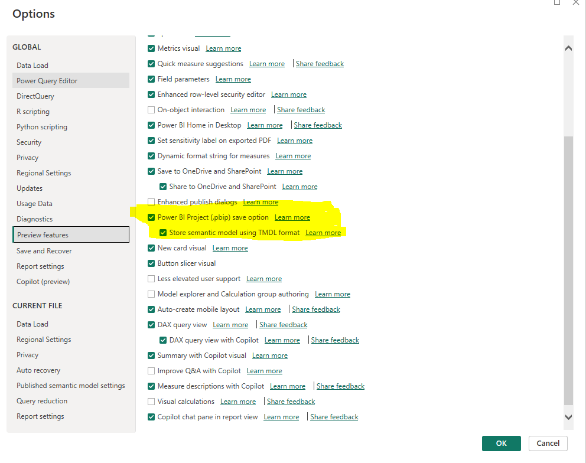

### Time Intelligence
Time Intelligence is a feature that will add a date time dimension table automatically for every date or date time column that is present in any query. This is generally not require and is advised to be switched off in the setting, `File -> Options and settings -> Options` and ensure that the below highlighted check box is **not** selected, `Auto date/time for new files`.

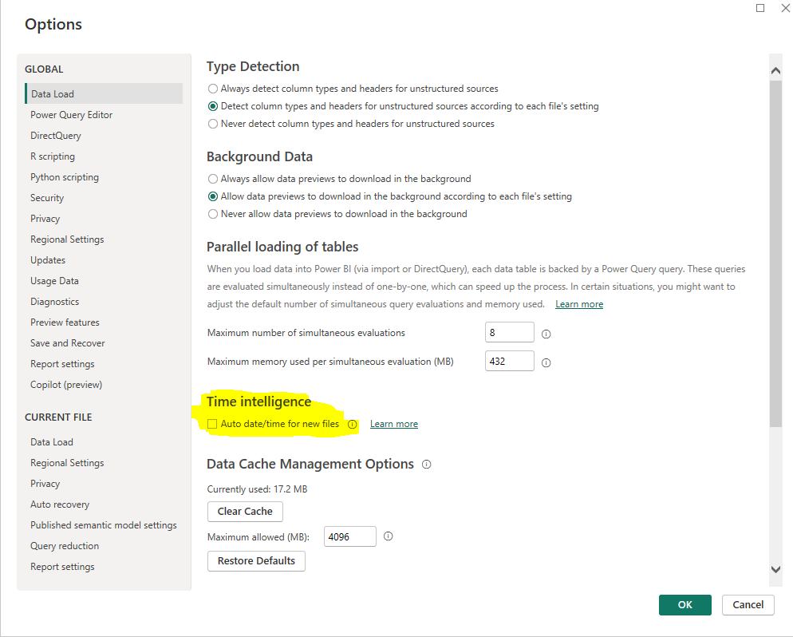


### Report Level Access
Access to the model is granted in Power BI portal by clicking on the model settings and selecting `Manage access`, you can then add users and groups to grant access to the symantic model.

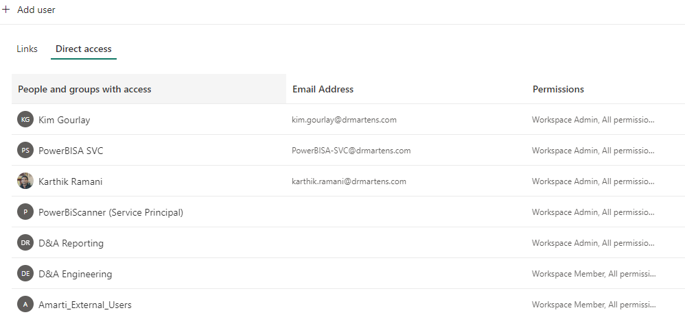

### Row Level Security
Row level security can be added to semantic models for fine grained security at a row level. Several of the current DMA reports such as D2C contain Row Level Security. This can be configured in the Power BI desktop or directly in the TMDL under the `roles` folder in the dataset folder as you can see below.

In Power BI desktop Row Level Security can be accessed via the `Modeling` tab and selecting.


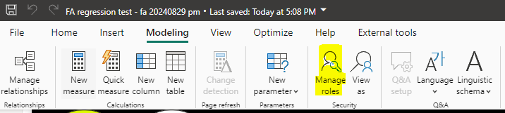

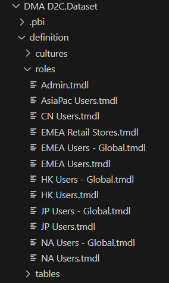

An example of a one of the TMDL files...

```yaml
role 'EMEA Retail Stores'
	modelPermission: read

	tablePermission Region =
			Region[Company ID] IN {
			        "202", "231", "232", "233", "234", "235", "236", "237", "238", "239",
			        "240", "241", "242", "243", "244", "245", "246", "247", "248", "249","251", "252", "253",
			        "295", "296", "297", "298", "299", "883", "884"
			    }
```

These Row Level Security groups need to have members associated with them in the Power BI portal which can either be an end user account or an Azure Active Directory group. These members can be added in the Power BI portal by clicking on the models settings and selecting `security` which can be seen in the image below.

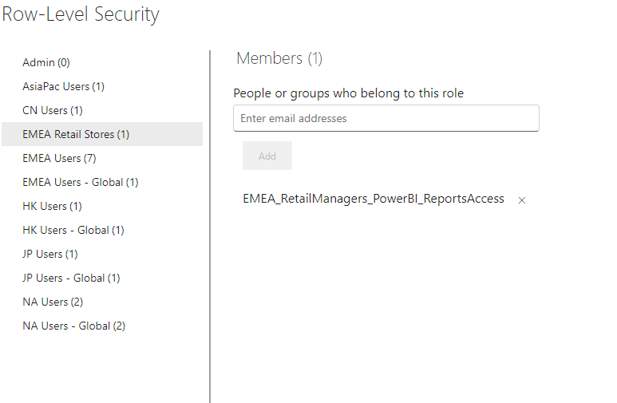


### Partitions
Every query in a Power BI model will have a default partition that contains the whole dataset. In some cases you will **not** want to refresh the whole of the data set when there is a large amount of data in the case of datasets set to `import` mode.

Custom multiple partitions need to be set up manually in the code and as it is not possible to do this in Power BI, please follow the structure in the following link, [partition-directory](#partitions-directory). Note that partitions should never overlap and need to be updated manually so consider how ganular you want your partitions to be, I would advise not being more granular than a month / period.

Any reports that have custom partitions will have to be swapped out to enable you to open the report. If this is not performed the report will fail to open in Power BI Desktop with the below error, `Sequence contains more than one element`

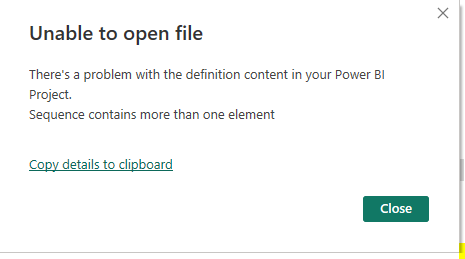

To make this a simple process I have create a cli tool to help perform this operation.

`poetry install`

You should then be able to use the cli tool to remove the custom partitions:

`pbi swap-partitions`

and run the following command to remove the original partition:

`pbi swap-partitions --no-original`

#### Partition Refresh
There are several ways to refresh a partition, by connecting to analysis services with a client such as Microsoft SQL Server Management Studio (SSMS), using the in house cli tool and via airflow which uses the same code base with a BaseOperator and Hook.
##### Using SSMS
You can log into Analysis Services using SSMS with the below server connection details and the service account.

|  Workspace | Server (Analysis Services)  |
|---|---|
| Dev  |powerbi://api.powerbi.com/v1.0/myorg/D%26A%20Dev%20-%20Dr.%20Martens%20Datasets   |
| UAT  |powerbi://api.powerbi.com/v1.0/myorg/D%26A%20UAT%20-%20Dr.%20Martens%20Datasets   |
| Production  |powerbi://api.powerbi.com/v1.0/myorg/Dr.%20Martens%20Datasets  |

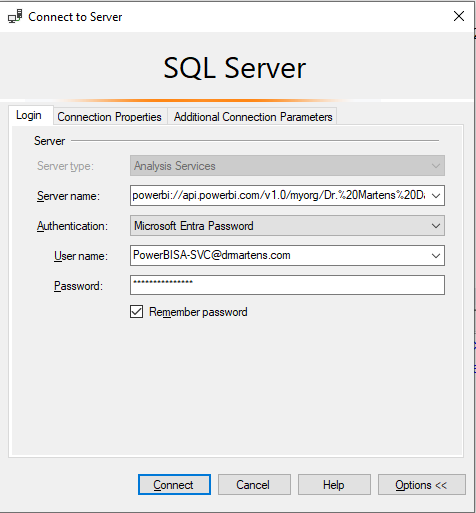

# Utilities Installation

To install the command line tool `pbi` simply install using any of the available python package managers such as `pip`, `poetry` or `pipx`.

It is recommended to install a python virtual environment, this can be accomplish in many ways with the package managers mentioned above. Currently `poetry` provides a simple way to manage dependencies and install the current project for you. `pipx` is useful for globally installing packages into there own discrete environments.

#### Installing with pip
Using pip you can create a local environment as follows:

```bash
pip -m venv .venv
```
 
 You will need to activate the environment which is dependant upon your operating system and then install from the pyproject.toml file as follows.
 ```
 source .venv/bin/activate
 pip install .
 pip install -e
 ```

 #### Installation with Poetry:
 `poetry install`

 Once you have installed the dependencies for the project and installed the current package you should be able to use the command line utility `pbp`. You can check available commands as follows:

 `pbi --help`


### Service Account:
Report are owned by the service account `PowerBISA-SVC@drmartens.com` and authorisation should be set to OAuth.

#### Azure Application Principle:

### Premium Workspace:

### Report Settings:


### Notes and Issues:


# Contribute:
Contributions should try to follow conventional commits if possible. As a minimum requirement a ticket number should be present in the branch and the commit message.